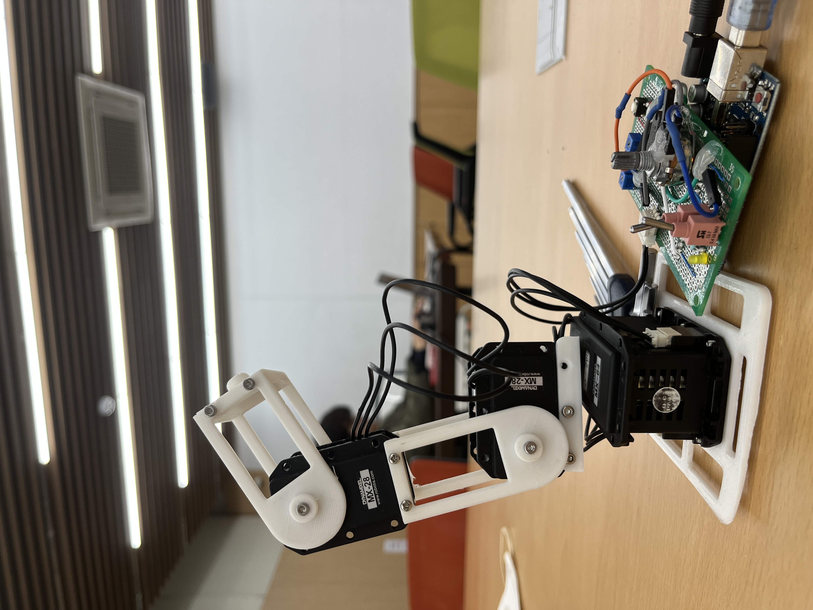

# 2022-2학기 명지대학교 임베디드 로보틱스 수업
* 3 DOF 메뉴플레이터 설계 및 개발
* 
* https://youtu.be/WQkYmM9BQwU
* 역기학모드
  * 직교좌표계로 좌를 입력하면 Endpoint가 해당 좌표로 이동
  * 문제를 쉽게 해석하기 위해 직교좌표계를 원통좌표계로 변환 $\phi$ 정보를 첫번째 관절에 제공
  * 
  * $r$과 $z$로 이뤄진 2차원 평면상에서 도해적으로 해석
    * 본인은 $\rho$ 대신 $r$문자 사용
  * 
  * 결과는 아래와 같음
  * 
  * 
  * $\theta_1$은 $theta_2$에 dependency가 있음
  * 즉, 직교좌표계 $\rightarrow$ 원통좌표계 $\rightarrow$ $\theta_2$ $\rightarrow$ $\theta_1$ 순으로 계산해야함
  * 코드로 구현하면 아래와 같음
  * ```cpp
    void cartsia2cylinder(double x, double y, double _z){
        double cord[3];
        pi = atan2(y,x) * 57.2958;
        r = sqrt(x*x + y*y);
        z = _z;
    }

    double findTheta2(double r, double z){
        double innerSqrt = ((L1 + L2)*(L1 + L2) - (r*r + z*z))/
                            ((r*r + z*z) - (L1 - L2)*(L1 - L2));
        return 2*atan(sqrt(innerSqrt))* 57.2958;
    }

    double findTheta1(double r, double z, double th2){
        double firstTerm = atan2(z,r)*57.2958;
        double secondTerm = atan2(L2*sin(th2),(L1 + L2*cos(th2)))* 57.2958;
        return firstTerm - secondTerm;
    }
    ```
  * 여차저차 $\theta_1$, $\theta_2$ 구해서 다이나믹셀에 전해주면 끝~
* POT 모드
  * 포텐셜 미터 값 읽어서 각관절 구동~
  
 ## Report


  
