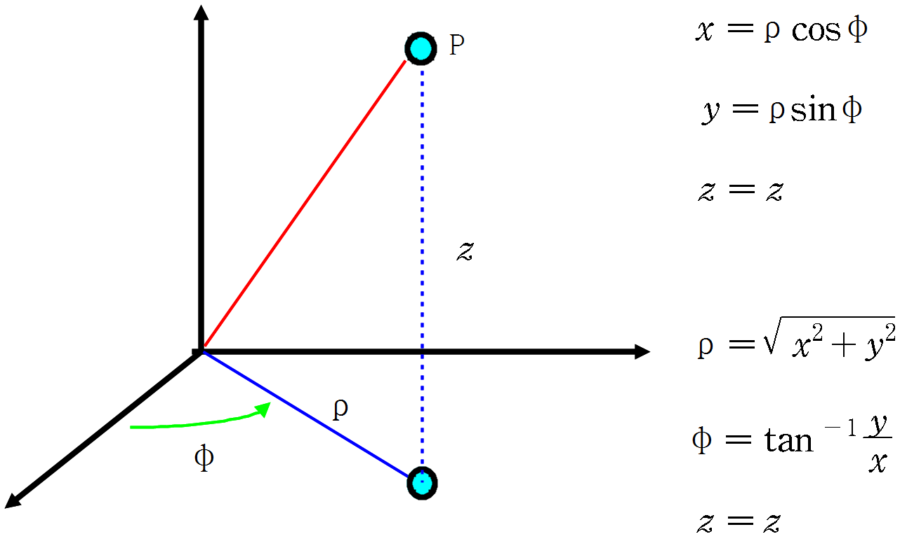

# 2022-2학기 명지대학교 임베디드 로보틱스 수업
* 3 DOF 메뉴플레이터 설계 및 개발
* 역기학모드
  * 직교좌표계로 좌를 입력하면 Endpoint가 해당 좌표로 이동
  * 문제를 쉽게 해석하기 위해 직교좌표계를 원통좌표계로 변환 $\phi$ 정보를 첫번째 관절에 제공
  * 
  * $r$과 $z$로 이뤄진 2차원 평면상에서 도해적으로 해석
    * 본인은 $\rho$ 대신 $r$문자 사용
  * 
  * 결과는 아래와 같음
  * 
  * 